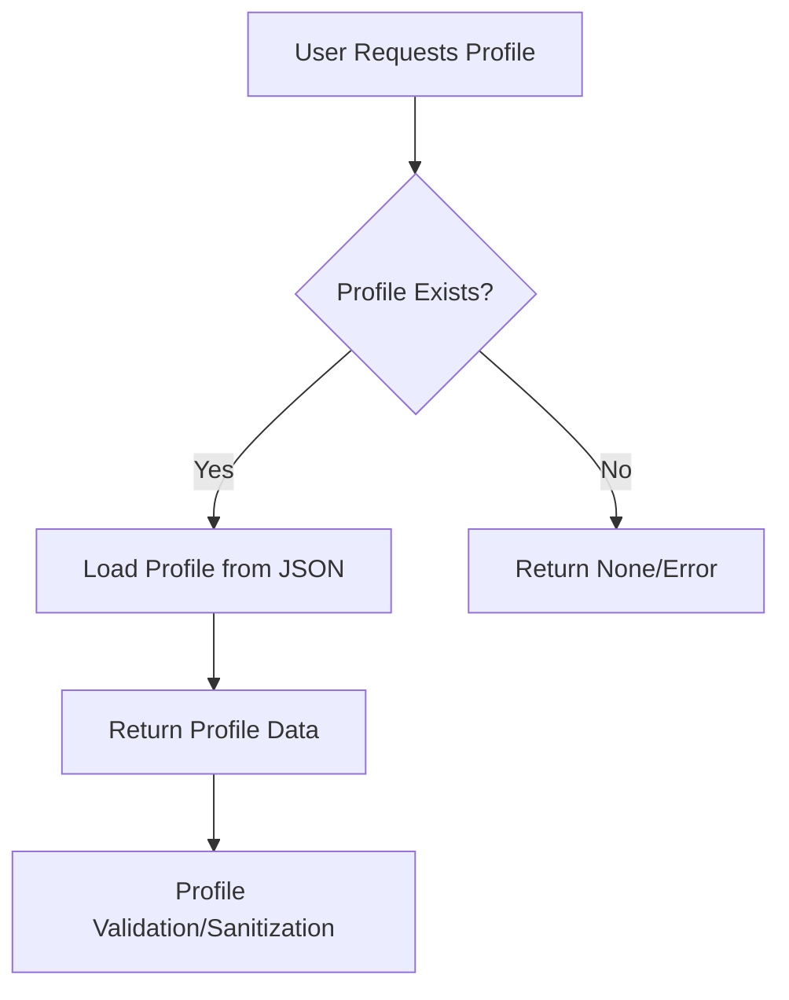
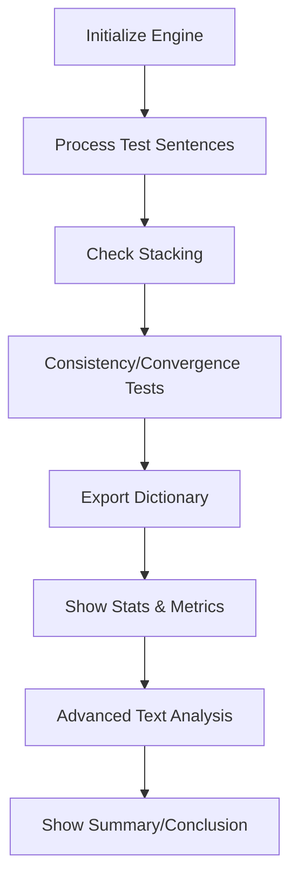
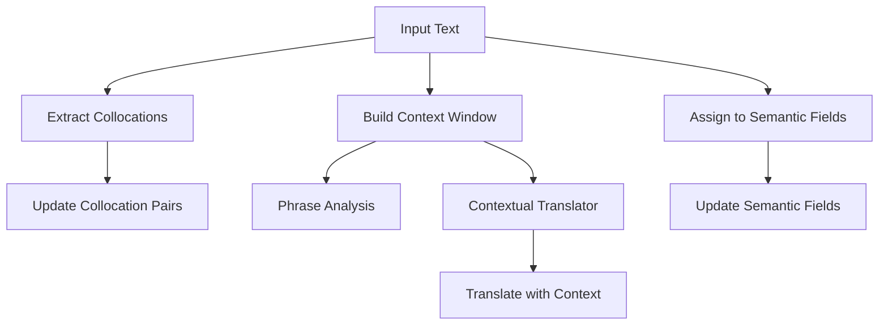
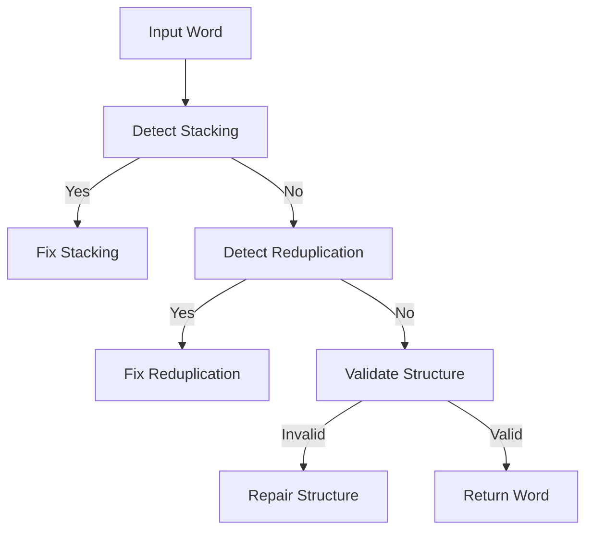
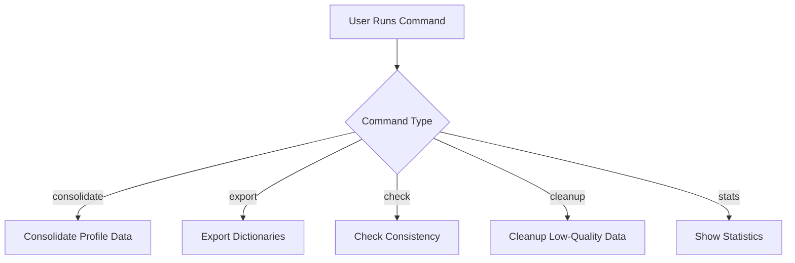
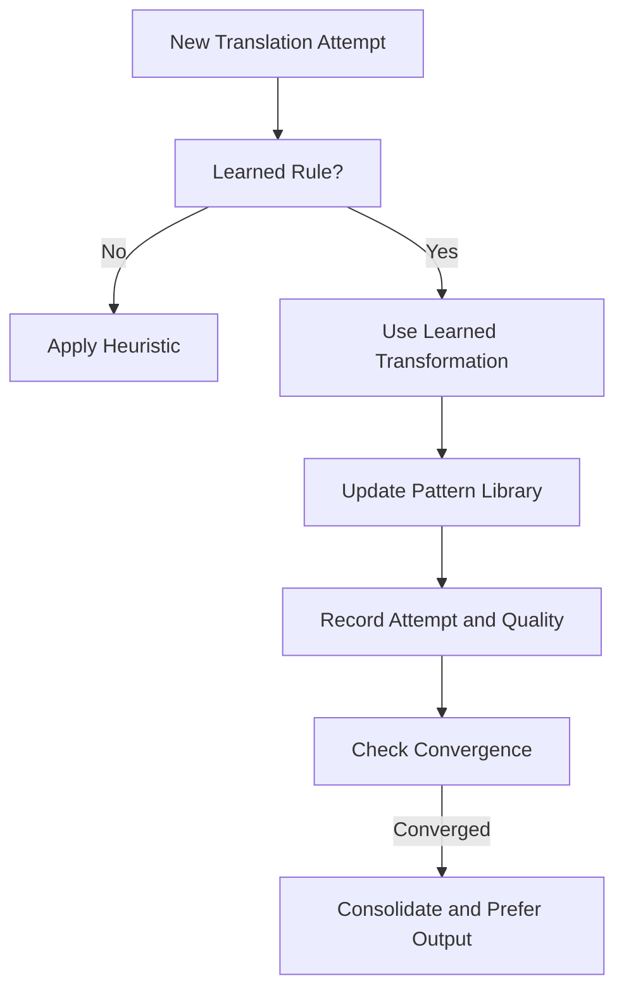
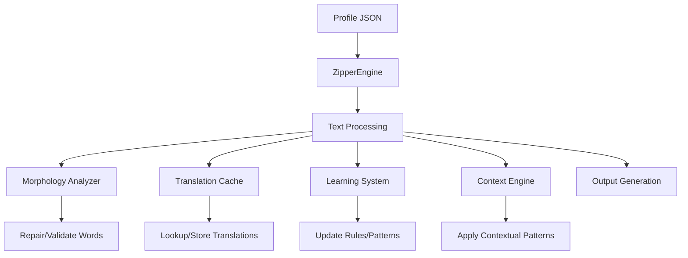
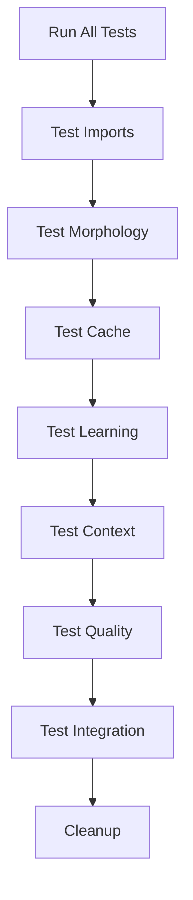
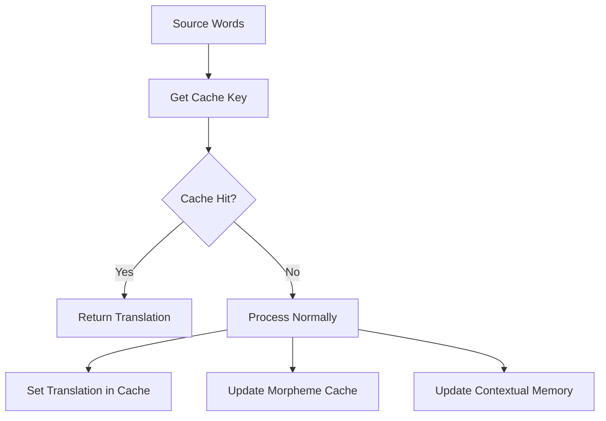

# Hadabian Language Zipper - Codebase Documentation

This documentation details the main modules that comprise the Hadabian Language Zipper system. Each file implements a crucial aspect of the language processing, profile management, linguistic analysis, and system tooling. Below you'll find a thorough breakdown of each file's purpose, key classes and functions, and their role in the overall architecture.

---

## language_profile_manager.py

This module manages language profiles, which define the properties, rules, and metadata for constructed languages used by the Zipper system.

### Key Classes

- **LanguageProfileManager**: Handles CRUD operations for language profiles (stored as JSON files).
- **ProfileValidator**: Validates and sanitizes profile dictionaries.

### Main Features

- **Load & Save Profiles**: Reads/writes profile JSONs from a `profiles` directory.
- **Profile Search**: Lookup profiles by ID, path, or get all IDs.
- **Profile Summaries**: Returns human-friendly summaries of a profile.
- **Default Profiles**: Can auto-generate a default example profile.
- **Validation**: Checks profiles for required fields and correct types.
- **Sanitization**: Adds defaults and repairs missing/invalid data.

### Example: Profile Data Structure

```json
{
  "id": "example",
  "name": "Example Language",
  "description": "An example constructed language profile",
  "bases": ["en", "es"],
  "fusion_weights": [0.6, 0.4],
  "fusion_rules": {
    "min_cut_point": 0.4,
    "preserve_caps": true
  },
  "phonotactics": {
    "vowels": "aeiou",
    "max_consonant_cluster": 3
  },
  "orthography": {},
  "global_seed": 12345
}
```

### Profile Management Flow



---

## example_demonstration.py

This script demonstrates the capabilities and improvements of the Zipper Engine, especially for the "Hadabian" language example.

### Main Steps

- **Initialize Engine**: Starts ZipperEngine with learning, caching, and context enabled.
- **Process Example Sentences**: Translates given English and Luxembourgish texts, showing consistency and improvements.
- **Check for Issues**: Detects and fixes word "stacking".
- **Analyze Consistency & Convergence**: Reports on translation stability, success rates.
- **Export Dictionary**: Outputs a bilingual dictionary to JSON.
- **Quality Metrics**: Calculates translation quality with detailed metrics.
- **Advanced Analysis**: Uses advanced text analyzer to inspect generated output.

### High-Level Demo Flow



---

## cli.py

**cli.py** provides a robust command-line interface to interact with the Hadabian Zipper system.

### Supported Commands

- **generate**: Produces new language text given a profile and input files.
- **list**: Shows all available profiles.
- **show**: Displays profile details in JSON.
- **create**: Generates a new profile (optionally from a template).
- **delete**: Removes a profile.
- **names**: Generates character or place names based on the language profile.
- **export**: Exports a word list/lexicon from a text file.
- **analyze**: Analyzes a text for linguistic statistics.
- **dialects**: Generates dialect variations of a profile.
- **setup**: Initializes project directories, example files, and templates.

### Structure

- Uses `argparse` for argument parsing.
- Each command is mapped to a function (`cmd_generate`, `cmd_list_profiles`, etc.).
- Handles profile management, text processing, and batch operations.

### Example: Generate Endpoint

#### Generate Text (CLI Command)
```api
{
    "title": "Generate Text",
    "description": "Generate new language text using a specified profile and base language inputs.",
    "method": "POST",
    "baseUrl": "cli-local",
    "endpoint": "/generate",
    "headers": [],
    "queryParams": [],
    "pathParams": [],
    "bodyType": "form",
    "formData": [
        {"key": "profile", "value": "Profile ID", "required": true},
        {"key": "inputs", "value": "Input files (one per base language)", "required": true},
        {"key": "output", "value": "Path to output file", "required": false},
        {"key": "stats", "value": "Show statistics", "required": false}
    ],
    "responses": {
        "200": {
            "description": "Success",
            "body": "Generated language output written to output file or printed to stdout."
        },
        "400": {
            "description": "Profile or input file error",
            "body": "Error message"
        }
    }
}
```

---

## context_engine.py

Implements semantic context analysis, phrase pattern management, and contextual translation logic.

### Key Classes

- **SemanticContextEngine**: Handles embeddings, collocations, semantic fields, and phrase patterns for a profile.
- **PhraseAnalyzer**: Analyzes phrase structure and type.
- **ContextualTranslator**: Uses context to enhance translation accuracy.
- **SemanticFieldBuilder**: Auto-detects semantic fields from corpora.

### Notable Features

- **Context Windows**: Extracts local word context (before, after, target).
- **Collocations**: Tracks word associations in context windows.
- **Semantic Fields**: Groups words by meaning/usage.
- **Phrase Patterns**: Learns and reuses phrase-level translations.
- **Contextual Meanings**: Associates translations with specific contexts.

### Semantic Context Data Flow



---

## morphology_analyzer.py

Contains advanced linguistic analysis and repair tools.

### Key Classes

- **MorphologyAnalyzer**: Detects and fixes stacking, reduplication, and analyzes morphemes and syllables.
- **ConsistencyValidator**: Tracks translation consistency for repeated words.
- **WordQualityScorer**: Assigns a score to candidate words based on linguistic criteria.

### Core Capabilities

- **Stacking Detection & Fix**: Identifies and repairs repeated morpheme patterns.
- **Reduplication Handling**: Detects and limits excessive repetition.
- **Word Decomposition**: Splits words into prefix, root, and suffix.
- **Syllable Extraction**: Splits words into syllables, considering diphthongs.
- **Phonetic Distance**: Calculates similarity between words.
- **Structure Validation**: Ensures word structure fits defined phonotactic rules.

### Morphological Processing



---

## maintenance_tool.py

Provides maintenance utilities for profile data: consolidation, export, consistency checks, cleanup, and stats.

### Available Commands

- **consolidate**: Merges cache and learning data, removing low-quality or infrequent variations.
- **export**: Outputs dictionaries in JSON, CSV, and TXT formats.
- **check**: Checks translation consistency and convergence.
- **cleanup**: Removes low-quality learning patterns and consolidates cache.
- **stats**: Displays detailed statistics about the profile, cache, learning, and consistency.

### Maintenance Flow



---

## learning_system.py

Handles adaptive learning, transformation rules, convergence, and weight optimization for the language zipper.

### Main Classes

- **LearningSystem**: Learns transformation rules, manages pattern libraries, and quality metrics.
- **ConvergenceEngine**: Tracks translation history for convergence/stability.
- **AdaptiveWeightSystem**: Optimizes fusion weights based on performance feedback.

### Capabilities

- **Transformation Rules**: Learns how to map source to target patterns, context-aware.
- **Pattern Library**: Stores learned translation patterns with usage and quality.
- **Convergence Checking**: Detects when translation outputs stabilize.
- **Adaptive Weights**: Adjusts the influence of base languages for optimal results.

### Learning/Convergence Flow




---

## main.py

Implements the main graphical user interface (GUI) for the Hadabian Language Zipper, using Tkinter.

### Features

- **Tabbed Interface**: Generator, Profile Manager, Profile Editor, Batch Processing.
- **Profile Management**: Create, edit, duplicate, delete profiles.
- **Language Generation**: Input multiple base texts, generate new language output.
- **Batch Processing**: Process multiple input files and save outputs.
- **Validation & Export**: Validate profiles, export outputs, and view stats.

### GUI Architecture

```mermaid
flowchart TD
    A[Main Window] --> B[Notebook (Tabs)]
    B --> C[Generator Tab]
    B --> D[Profile Manager Tab]
    B --> E[Profile Editor Tab]
    B --> F[Batch Processing Tab]
    C --> G[Language Generation]
    D --> H[Profile List/CRUD]
    E --> I[Profile Edit Forms]
    F --> J[Batch Processing Controls]
```

---

## test.py

A simple script for comparing two pieces of text using Python's `difflib`, mainly for regression or quality checks.

### Usage

- Define two text blocks (`text1`, `text2`).
- Use `compare_texts` to show whether they are identical or print their diff.

---

## zipper_engine.py

**The core engine of the Hadabian Language Zipper.**

### Class: ZipperEngine

- **Initialization**: Loads profile, sets up analyzers, caches, learning, and context modules.
- **process_texts**: Main entry for generating new language text from multiple base language texts.
- **Fusion**: Fuses base words/syllables using weights, phonotactics, historical drift, and repairs.
- **Quality Assurance**: Uses morphology analyzer, consistency validator, and convergence checks.
- **Agglutination**: Optionally merges short words.
- **Orthography**: Applies profile's writing system rules.
- **Caching & Learning**: Integrates translation cache and learning pattern updates.

### System Architecture



---

## utilities.py

A toolbox for text analysis, quality metrics, lexicon export, optimization, and reporting.

### Main Classes

- **AdvancedTextAnalyzer**: Rich statistics and text structure analysis.
- **QualityMetrics**: Translation quality scoring (length, diversity, phonetics, structure).
- **BatchProcessor**: Multi-file batch processing.
- **DictionaryExporter**: Exports dictionaries in three formats.
- **ProfileOptimizer**: Tunes profile weights for best quality.
- **ConsistencyReporter**: Finds inconsistencies and suggests corrections.

### Example: Quality Metrics Structure

```json
{
  "overall_quality": 0.92,
  "component_scores": {
    "length_preservation": 1.0,
    "lexical_diversity": 0.9,
    "phonetic_balance": 0.8,
    "structural_validity": 1.0
  },
  "details": {
    "source": {...},
    "generated": {...},
    "comparison": {...}
  }
}
```

---

## test_suite.py

A comprehensive test runner for all core modules and integration flows.

### Test Coverage

- **Module Imports**: Checks that all modules are importable.
- **Morphology, Cache, Learning, Context, Quality, Integration**: Each major feature gets its own test.
- **Cleanup**: Removes test artifacts after execution.

### Test Suite Workflow



---

## translation_cache.py

Implements persistent translation, morpheme, and context caching for fast and consistent outputs.

### Main Classes

- **TranslationCache**: Maps source words to target, tracks frequency and variations.
- **MorphemeCache**: Stores roots, prefixes, suffixes, and decomposition patterns.
- **ContextualMemory**: Caches phrase translations and semantic clusters.

### Cache Data Flow



---

```card
{
  "title": "Key Takeaways",
  "content": "The Hadabian Language Zipper system is highly modular, supporting deep linguistic fusion, profile-driven generation, contextual translation, and robust quality metrics, all accessible via CLI and GUI."
}
```